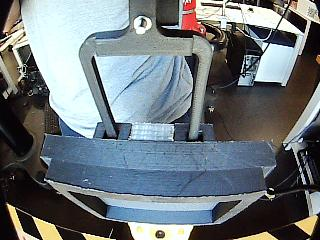
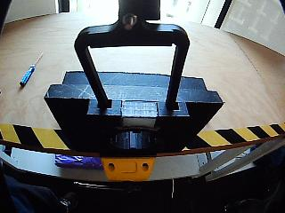
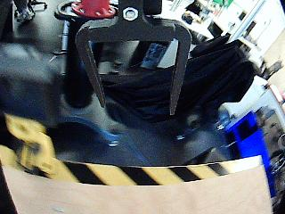

Dataset for [Deformable insertion in Robotics](https://drive.google.com/open?id=1lEIG9VAJpvDLlCdHluc3I7nOzOaxMSG4QdbW3nALNmg)
The task for this dataset is to determine whether or not a clip is inserted or not.

## Examples:

### True:
</img>
</img>

### False:
</img>
</img>
